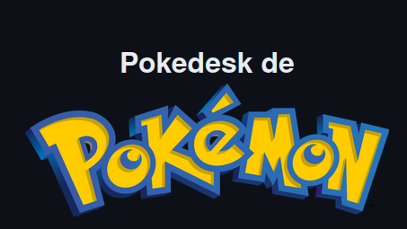
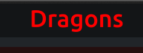
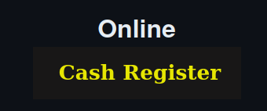

  
# Hola, mi nombre es Jhojan Toro👋
 

 
**
Soy Desarrollador Junior con más de 2 años de experiencia en el desarrollo de paginas, aplicativos WEB y aplicativos de escritorio. Actualmente sigo desarrollándome, estudiando y Mejorando cada Día para así  poder evolucionar en este grandioso mundo de la Informática y el Desarrollo de Software
**
 

## Ultimos proyectos Trabajados

<table >
  <tr> 
  <td>
   <a href='https://github.com/jdtp125753/Pokedesk' target='_blank'>
      
   </td>
    <td>
      
    </td>
    
  </tr> 
  <tr>
  <td>
       
    </td>
  <td>
    
  </td>
    
  </tr>
  </a>

</table>

    
## Lenguages de Programación

## Tecnologías y Frameworks
### Backend

### Frontend

## Herramientas

  
  

### Ultimos Videos de mi canal de  

  
  
  
  
  
  
  
  
  
  
  
  
  

  

## Estadísticas de GitHub

  
## Los lenguajes más utilizados
  

 
  

  

