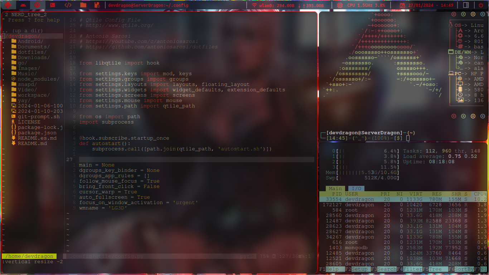

  
# Hola, mi nombre es Jhojan 
 

 
**
 Desarrollador Front-end con iniciativa y habilidades destacadas en el
diseño y desarrollo de páginas web. Poseo una sólida organización y
habilidades multitarea, buscando activamente una posición laboral
que me permita aplicar mis destrezas y experiencia en beneficio tanto
de la empresa como de sus clientes. Apasionado por la creación de
experiencias digitales atractivas y funcionales, estoy comprometido
con contribuir al crecimiento y éxito del equipo mediante la
implementación de soluciones innovadoras y un enfoque proactivo en
cada proyecto :fire:
** 
 

## Resumen

 

 
  

 
## Ultimos proyectos Hechos 

<table >
  <tr> 
    <td>
      <a href='https://github.com/DevJhojan/space_files'>
        Configuration Archilinux
        
      </a>
    </td> 
    <td width='50%'>
   
   </td>
   
  </tr> 
  <tr>
    <td>
      
    </td>
    <td>
       
    </td>
  </tr>

</table>

## Tecnologías y Frameworks con projectos hechos o compartidos

### Backend

<!--

-->

### Frontend

## Herramientas

## Estudiando actualemente

## Sistemas operativos

## Con Conocimiento

  
  

### Ultimos Videos de mi canal de  

  
  

  
  
  
  
  
  

 

